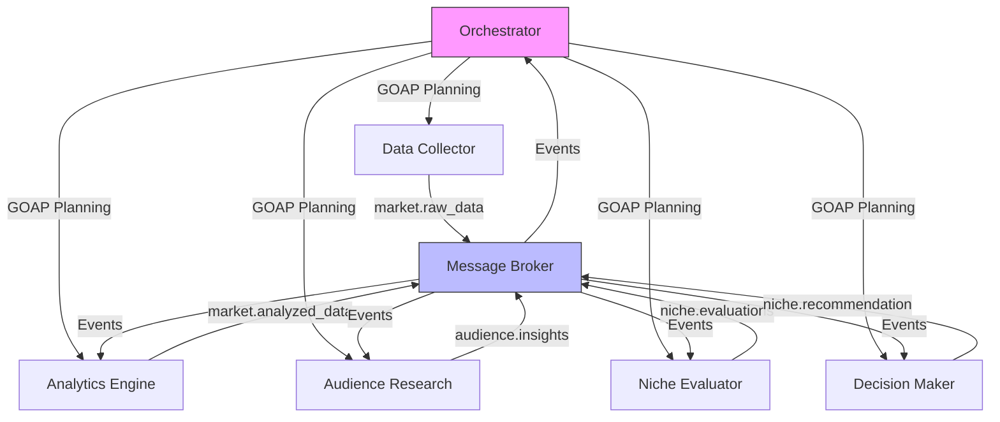
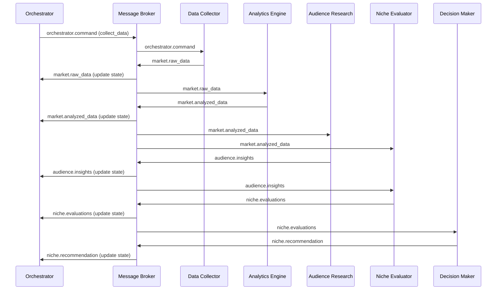

# 🚀 Marketplace Niche Scout (MNS)  

**An AI-powered system for automated niche discovery on marketplaces using GOAP planning**  

  

## 🔍 Overview  

**Marketplace Niche Scout** is an intelligent system that:  
- 🤖 Automatically analyzes marketplace trends using multi-agent robotics  
- 🧠 Employs Goal-Oriented Action Planning (GOAP) for adaptive decision-making  
- 📊 Evaluates profitability, competition, and audience fit  
- 🏆 Recommends winning product categories with confidence scoring  

Perfect for e-commerce sellers looking to expand to new marketplaces like Amazon, Wildberries, or Shopify.  

## 🌟 Key Features  

| Feature | Description |  
|---------|-------------|  
| 🕵️‍♂️ Smart Data Collection | Automated scraping of sales data, prices, and competitor info |  
| 📈 Trend Analysis | Identifies seasonal patterns and emerging trends |  
| 🎯 Audience Matching | Builds customer personas and detects unmet needs |  
| ⚖️ Risk Evaluation | Calculates market saturation and entry barriers |  
| 🚦 Compliance Check | Verifies marketplace category rules automatically |  

## 🛠️ System Components  


---



---



1. **Scout Bots** (Data Gatherers)  
   - Marketplace API integration  
   - Web scraping fallback system  
   - Real-time data validation  

2. **Analytics Hub**  
   - Time-series forecasting  
   - Competitive matrix builder  
   - Price elasticity modeling  

3. **Decision Core**  
   - GOAP-based planning engine  
   - Multi-criteria scoring  
   - Risk/reward optimizer  

## ⚡ Quick Start  

```bash  
# Clone repository  
git clone https://github.com/yourrepo/marketplace-niche-scout.git  

# Install dependencies  
pip install -r requirements.txt  

# Run main system  
python orchestrator.py --platform wildberries --region RU  
```  

## 📈 Sample Output  

```json  
{  
  "recommended_niche": "Smart Home Gadgets",  
  "confidence_score": 0.87,  
  "reasons": [  
    "34% MoM growth trend",  
    "Low competition (0.2 index)",  
    "High audience match (0.91 score)",  
    "45% estimated ROI"  
  ],  
  "next_steps": [  
    "Verify supplier availability",  
    "Check logistics requirements",  
    "Prepare 3 product variations"  
  ]  
}  
```  

## 🧠 Intelligent Features  

- 🔄 **Adaptive Re-planning**: Automatically adjusts strategy when market conditions change  
- 🎚️ **Priority Scoring**: Focuses on high-impact analysis first  
- 🧩 **Modular Design**: Easily add new marketplace connectors  
- 📉 **Risk Avoidance**: Identifies and flags declining categories  

## 🤝 Contributing  

We welcome contributions! Please see our:  
- [Contribution Guidelines](CONTRIBUTING.md)  
- [Roadmap](ROADMAP.md)  
- [Issue Tracker](https://github.com/yourrepo/issues)  

## 📜 License  

MIT License - Free for commercial and personal use  

---

**💡 Pro Tip**: Combine with our [Product Sourcing Bot](https://github.com/example) for complete marketplace automation!  

[](https://buymeacoffee.com/yourprofile)  

```
Made with ❤️ by AI Commerce Labs
```